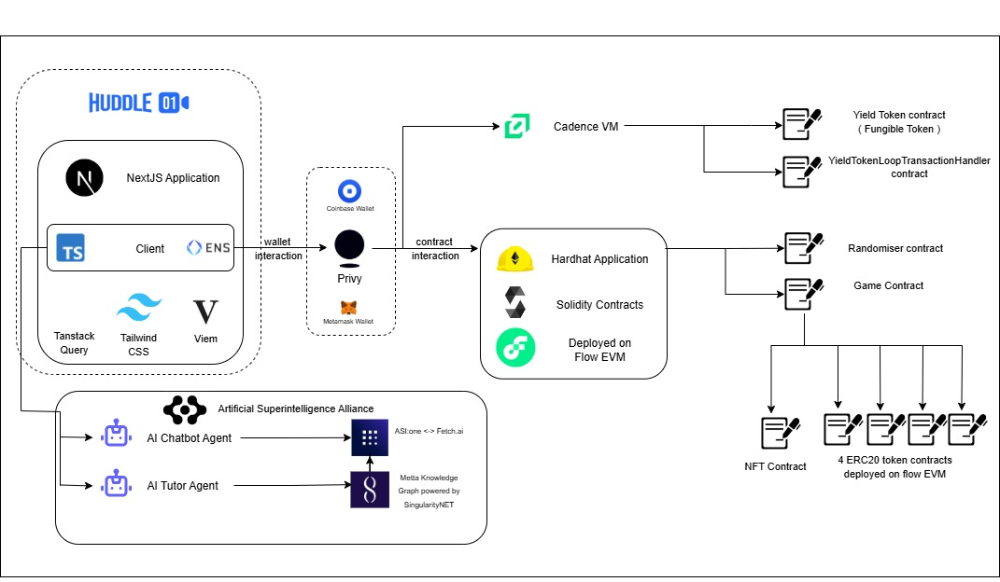

# 🎯 Multipoly

> A submission for **ETHGlobal New Delhi 2025** by **Team Multipoly**

## 🌟 Overview

Multipoly is a blockchain-powered multiplayer board game set in Delhi, combining **AI agents**, **NFT properties**, and **real-time strategy gameplay**. Players explore 24 iconic Delhi locations, collect themed tokens, and build their property empires with **Web3** mechanics and **AI-powered assistance**.


**🌐 Live Demo**: [https://multipoly.onrender.com](https://multipoly.onrender.com)

---

## 🎯 Sponsor Tracks (ETHGlobal New Delhi 2025)

## Flow Blockchain Integration  
Multipoly fully harnesses the **Flow ecosystem** to deliver scalable, transparent, and interactive Web3 gameplay. Core mechanics are deployed in **Cadence**, managing fungible tokens, staking, and yield generation through the **Flow Scheduler**. Decentralized room management ensures fair multiplayer sessions, while **Chainlink VRF** provides secure on-chain randomness for dice rolls. With additional **Flow EVM compatibility**, Multipoly seamlessly combines **Cadence and Solidity contracts** within the same ecosystem.  

---
 
1. **Smart Contract Deployment**  
   - Core gameplay mechanics are deployed on **Flow’s native chain**.  
   - Contracts are written in **Cadence** to handle fungible tokens, staking, and state persistence.  

2. **Fungible Tokens & Yield Staking**  
   - Players can **earn and stake tokens** seamlessly during gameplay.  
   - **Flow Scheduler** automates yield simulation, enabling a dynamic in-game economy.  

3. **Educational Game Mechanics**  
   - **Decentralized room management** ensures transparent and fair multiplayer sessions.  
   - **On-chain randomness (VRF)** secures dice rolls, guaranteeing fairness and transparency.  

4. **Flow EVM Compatibility**  
   - Core **Solidity contracts** are deployed on **Flow EVM**, extending interoperability.  
   - This allows **Cadence and Solidity contracts** to co-exist and complement each other within the Flow ecosystem.  


## 🤖 ASI Alliance Integration   
Multipoly integrates the **ASI agent ecosystem** end-to-end. Our **AI Tutor** and **Chatbot** are live on **AgentVerse**, powered by **MeTTa knowledge graphs** for strategic gameplay analysis. Communication runs on the **uAgents protocol**, with agents exposed via **RESTful endpoints** to deliver seamless, real-time advice and chat directly in-game. This creates a **full-circle ASI integration**, combining multiple agents, decentralized communication, and transparent public deployment.  

---

1. **Agent Deployment** → AI Tutor & Chatbot deployed on AgentVerse with public profiles and documentation.  
2. **Strategic Intelligence** → MeTTa knowledge graphs power gameplay analysis and strategic advice.  
3. **Decentralized Communication** → uAgents protocol ensures secure and decentralized agent interactions.  
4. **REST Endpoints** → Agents exposed as REST APIs for seamless frontend–backend integration.  
5. **Full-Circle Use Case** → Combines multiple agents, MeTTa graphs, REST APIs, and decentralized deployment into a complete ASI showcase.  

## 🔗 ENS Integration  

Multipoly integrates **Ethereum Name Service (ENS)** to simplify wallet interactions with **human-readable names**. This makes gameplay more intuitive and secure, while showcasing a **real-world application of ENS** in a multiplayer Web3 gaming environment.  

---

1. **Human-Readable Naming**  
   - ENS replaces long Ethereum addresses with **easy-to-read names**.  
   - Enhances accessibility and usability for players.  

2. **Seamless Wallet Interactions**  
   - Simplifies deposits, transfers, and staking with **intuitive identifiers**.  
   - Reduces user errors and improves the onboarding experience.  

3. **Practical Adoption in Gaming**  
   - ENS is fully integrated into **multiplayer room sessions**.  
   - Demonstrates how Web3 naming systems can be **applied in real-world gaming scenarios**.  


---

## ⚡ Key Features

- **24 Delhi Locations**: Heritage sites, business hubs, education centers, entertainment districts
- **4 Token Categories**: 🔴 Heritage | 🔵 Business | 🟢 Education | 🟡 Entertainment
- **AI Agents**: Gameplay assistant & strategic tutor
- **NFT Properties**: ERC-721 landmarks
- **Real-Time Multiplayer**: WebRTC-powered sync and chat
- **Verifiable Randomness**: Chainlink VRF for dice rolls

---

## 📊 Architecture

<div align="center">



_Multipoly combines Web3, AI, and real-time communication in a distributed architecture._

</div>

---

## 🛠️ Tech Stack

### AI & Agents (ASI Alliance)

- **AgentVerse Deployment**: Both the Multipoly Tutor and Multipoly Chatbot agents are publicly deployed on AgentVerse, with dedicated profiles and documentation for each agent.
- **MeTTa Knowledge Graphs**: The Tutor agent uses MeTTa-powered knowledge graphs to analyze game state and provide strategic recommendations.
- **uAgents Framework**: Agents were originally built using the uAgents protocol for decentralized agent communication.
- **REST Endpoints**: For seamless frontend-backend integration, both agents are now exposed via RESTful API endpoints, allowing real-time advice and chat directly from the game interface.
- **Chatbot Agent**: General help with ASI:One models
- **Tutor Agent**: Move analysis & strategic advice
- **Knowledge Graph**: MeTTa-powered game state
<div align="left">

<strong>Multipoly Tutor:</strong> 
<a href="https://agentverse.ai/agents/details/agent1qv8zynx5ecsheyjzkmjl6pp4a6pz0v5d5f7he09argvzm4qqk4tls0kdswd/profile" target="_blank">MultiPoly Tutor</a>

<strong>Multipoly Chatbot:</strong> 
<a href="https://agentverse.ai/agents/details/agent1qtyccpkwul3kdmrrud2dm65pdm3kz3s2jvmmmzz8v9dxkx00gmkyzg48kg0/profile" target="_blank">Multipoly Chatbot</a>

</div>

### Blockchain

- **Flow**: Game state persistence, yield tokens, decentralized room management, and automated yield generation via the Flow scheduler module.
- **Cadence**: Used for deploying fungible tokens and managing staking mechanics.
- **VRF**: Integrated for secure, on-chain dice rolls, ensuring fairness and transparency in gameplay.
- **Ethereum**: ERC-721 NFTs, Hardhat contracts
- **ENS**: Used for Ethereum address resolution and human-readable naming throughout the game.

### Core

- **Frontend**: Next.js 14, Tailwind CSS, shadcn/ui
- **Backend**: Python Flask API, CORS-enabled
- **Real-time**: WebRTC (video + gameplay sync)

---

## 🚀 Installation & Setup

### Prerequisites

- Node.js 18+
- Python 3.9–3.12
- Git

### Quick Start

```bash
# Clone repository
git clone https://github.com/imApoorva36/multipoly.git
cd multipoly

# Setup AI Agents
cd agents
pip install -r requirements.txt
cp example.env .env   # add API keys
python start.py

# Setup Frontend (new terminal)
cd ../frontend
npm install
npm run dev

# Setup Smart Contracts (new terminal)
cd ../multipoly_contract
npm install
npx hardhat compile
npx hardhat deploy
```

### Environment Variables

**agents/.env**

```env
ASI_ONE_API_KEY=your_asi_one_api_key_here
CHAT_URL=http://127.0.0.1:8010/chat
TUTOR_URL=http://127.0.0.1:8011/advise
```

**frontend/.env.local**

```env
NEXT_PUBLIC_HUDDLE_PROJECT_ID=your_huddle_project_id
NEXT_PUBLIC_HUDDLE_API_KEY=your_huddle_api_key
```

---

## 🔗 API Endpoints

### Health & Status

```bash
GET https://multipoly.onrender.com/health
GET https://multipoly.onrender.com/agents/info
```

### AI Chat Agent

```bash
POST https://multipoly.onrender.com/api/chat
{
  "user_id": "player123",
  "message": "How do I win at Multipoly?"
}
```

### Tutor Agent (Strategic Advice)

```bash
POST https://multipoly.onrender.com/api/advise
{
  "user_id": "player123",
  "state": {"position": 5, "tokens": {"red": 3}},
  "question": "Should I buy Red Fort?"
}
```

---

## 🎯 Game Rules

### Victory Conditions

- **Token Master**: Collect 15+ tokens
- **Property Mogul**: Own 8+ properties across groups
- **Delhi Emperor**: ₹10,000+ net worth

### Locations & Tokens

- 🔴 **Heritage**: Red Fort, Qutub Minar, Humayun's Tomb, India Gate, Lotus Temple, Akshardham
- 🔵 **Business**: Connaught Place, Cyber City Gurgaon, Nehru Place, Karol Bagh, Lajpat Nagar, Khan Market
- 🟢 **Education**: Delhi University, JNU, IIT Delhi, National Museum, Pragati Maidan, Raj Ghat
- 🟡 **Entertainment**: Chandni Chowk, Sarojini Nagar, Dilli Haat, Select City Walk, Hauz Khas, CP Metro Station

### Core Mechanics

- **Starting Cash**: 100 Units of each token
- **Property Prices**: 20-50 Units
- **Turn**: Roll dice → Move → Buy/Pay → Collect tokens
- **Special Cards**: Delhi Metro (travel), Traffic Jam, Monsoon, Festival Bonus

---

## 🏗️ Project Structure

```
multipoly/
├── agents/              # AI backend (Flask + agents)
├── frontend/            # Next.js frontend
├── multipoly_contract/  # Ethereum smart contracts
├── vrf/                 # Chainlink VRF contracts
├── flow_schedular/      # Flow blockchain integration
├── arch_diag.jpg        # Architecture diagram
└── README.md            # Project guide
```

---

## 👥 Team

| Name                | GitHub                                           |
| ------------------- | ------------------------------------------------ |
| **Fahim Ahmed**     | [@ahmedfahim21](https://github.com/ahmedfahim21) |
| **Apoorva Agrawal** | [@imApoorva36](https://github.com/imApoorva36)   |
| **Vedant Tarale**   | [@VedantTarale](https://github.com/VedantTarale) |
| **J Hariharan**     | [@j-hariharan](https://github.com/j-hariharan)   |

---

## 📝 Contributing

We welcome community contributions!

- Fork the repo
- Create a branch (`git checkout -b feature-name`)
- Commit (`git commit -m "Add feature"`)
- Push & open a PR

---

## 📄 License

This project is licensed under the **Apache 2.0 License**.

---

<div align="center">

### 🎮 Experience the future of board games with Web3 & AI

[](https://multipoly.onrender.com)

**Built with ❤️ at ETHGlobal New Delhi 2025**

</div>
