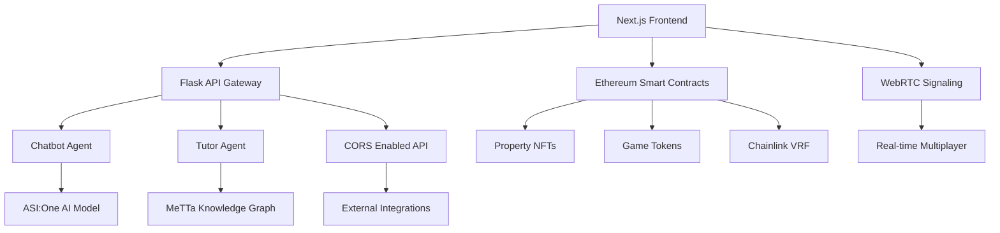

# 🎯 Multipoly

**🏆 ETHGlobal New Delhi 2025 Submission**

> An educational blockchain-powered multiplayer board game set in Delhi, featuring AI agents, NFT properties, and real-time strategy gameplay.

## 🚀 **Live Demo**

**🌐 Main Application**: [https://multipoly.onrender.com](https://multipoly.onrender.com)

## 👥 **Meet the Team**

| Team Member         | GitHub                                           |
| ------------------- | ------------------------------------------------ |
| **Fahim Ahmed**     | [@ahmedfahim21](https://github.com/ahmedfahim21) |
| **Apoorva Agrawal** | [@imApoorva36](https://github.com/imApoorva36)   |
| **Vedant Tarale**   | [@VedantTarale](https://github.com/VedantTarale) |
| **J Hariharan**     | [@j-hariharan](https://github.com/j-hariharan)   |

## 🎮 **Game Overview**

Multipoly transforms the beloved board game experience into a cutting-edge Web3 application. Set against the backdrop of Delhi's iconic landmarks, players navigate through 24 carefully curated locations.

### **🌟 Key Features**

- **🏛️ Delhi-Themed Board**: 24 authentic Delhi locations from Red Fort to Cyber City
- **🤖 AI-Powered Assistance**: Smart agents for gameplay guidance and chat
- **⛓️ Blockchain Foundation**: NFT properties with real ownership and trading
- **📱 Real-Time Multiplayer**: WebRTC-powered seamless gaming experience

## 🔗 **API Endpoints**

### **Health Check**

```bash
GET https://multipoly.onrender.com/health
```

### **Chat with AI**

```bash
POST https://multipoly.onrender.com/api/chat
Content-Type: application/json

{
  "message": "Hello, how do I play?"
}
```

### **Get Game Advice**

```bash
POST https://multipoly.onrender.com/api/advise
Content-Type: application/json

{
  "state": {"position": 5, "tokens": {"red": 2}},
  "question": "Should I buy this property?"
}
```

## 🎯 **Game Rules**

### **24 Delhi Locations**

#### **🔴 Red Tokens - Heritage Sites**

1. Red Fort 🏰
2. Qutub Minar 🗼
3. Humayun's Tomb 🕌
4. India Gate 🏛️
5. Lotus Temple 🪷
6. Akshardham Temple 🛕

#### **🔵 Blue Tokens - Business Hubs**

1. Connaught Place 🏢
2. Cyber City Gurgaon 💻
3. Nehru Place 🔌
4. Karol Bagh 🏪
5. Lajpat Nagar 🛍️
6. Khan Market 🥘

#### **� Green Tokens - Education Centers**

1. Delhi University 📚
2. JNU 🎓
3. IIT Delhi ⚙️
4. National Museum 🏛️
5. Pragati Maidan 🏗️
6. Raj Ghat 🕯️

#### **🟡 Yellow Tokens - Entertainment**

1. Chandni Chowk 🛒
2. Sarojini Nagar 👕
3. Dilli Haat 🎨
4. Select City Walk 🏬
5. Hauz Khas Village 🍻
6. CP Metro Station 🚇

## 🛠️ **Quick Setup**

```bash
# Clone repository
git clone https://github.com/imApoorva36/multipoly.git

# Setup Backend
cd agents
pip install -r requirements.txt
python start.py

# Setup Frontend
cd ../frontend
npm install
npm run dev
```

## 🏆 **ETHGlobal New Delhi 2025**

Built with ❤️ by Team Multipoly for ETHGlobal New Delhi 2025

---

**🎮 Ready to play? Visit [https://multipoly.onrender.com](https://multipoly.onrender.com)**

---

## 🏆 **ETHGlobal New Delhi 2025**

**Team Multipoly** proudly presents our submission for ETHGlobal New Delhi 2025 - a revolutionary take on the classic board game, reimagined with blockchain technology, AI agents, and Delhi's rich cultural heritage.

### **👥 Meet the Team**

| Team Member         | GitHub                                           |
| ------------------- | ------------------------------------------------ |
| **Fahim Ahmed**     | [@ahmedfahim21](https://github.com/ahmedfahim21) |
| **Apoorva Agrawal** | [@imApoorva36](https://github.com/imApoorva36)   |
| **Vedant Tarale**   | [@VedantTarale](https://github.com/VedantTarale) |
| **J Hariharan**     | [@j-hariharan](https://github.com/j-hariharan)   |

---

## 🚀 **Live Demo**

**🌐 Main Application**: [https://multipoly.onrender.com](https://multipoly.onrender.com)

## 📋 **Table of Contents**

- [🎮 Game Overview](#-game-overview)
- [� System Architecture](#-system-architecture)
- [�🔗 API Endpoints](#-api-endpoints)
- [🏛️ Game Rules](#-game-rules)
- [🏗️ Project Structure](#-project-structure)
- [🛠️ Development Setup](#-development-setup)
- [🤖 AI Agents](#-ai-agents)
- [⛓️ Blockchain Integration](#-blockchain-integration)
- [📱 Frontend](#-frontend)
- [🚀 Deployment](#-deployment)
- [👥 Team & Credits](#-team--credits)

## 🎮 **Game Overview**

Multipoly transforms the beloved board game experience into a cutting-edge Web3 application. Set against the backdrop of Delhi's iconic landmarks, players navigate through 24 carefully curated locations, each representing different aspects of the city's rich heritage and modern development.

### **🌟 Key Innovations**

- **🏛️ Delhi-Themed Board**: 24 authentic Delhi locations from Red Fort to Cyber City
- **🎭 Cultural Integration**: 4 token types representing Delhi's diverse character
- **🤖 AI-Powered Assistance**: Smart agents for gameplay guidance and chat
- **⛓️ Blockchain Foundation**: NFT properties with real ownership and trading
- **🎲 Verifiable Randomness**: Chainlink VRF ensures fair gameplay
- **📱 Real-Time Multiplayer**: WebRTC-powered seamless gaming experience
- **🎯 Strategic Depth**: Advanced tokenomics and property synergies

### **� ETHGlobal New Delhi Special Features**

- **Local Heritage Focus**: Celebrating Delhi's monuments and culture
- **Community Driven**: Built for the Indian Web3 ecosystem
- **Educational Value**: Players learn about Delhi while having fun
- **Scalable Architecture**: Ready for mass adoption

---

## 📊 **System Architecture**

<div align="center">
  
  
  
  *Multipoly's distributed architecture combining Web3, AI, and real-time gaming*

</div>

### **🏗️ Architecture Components**

#### **Frontend Layer**

- **Next.js 14**: Modern React framework with SSR
- **WebRTC Integration**: Real-time peer-to-peer communication
- **Wallet Integration**: MetaMask and WalletConnect support
- **Responsive Design**: Mobile-first approach with Tailwind CSS

#### **Backend Services**

- **Flask API Gateway**: RESTful API orchestration
- **AI Agents**: Autonomous chatbot and strategy tutor
- **Real-time Communication**: WebSocket and WebRTC signaling

#### **Blockchain Layer**

- **Smart Contracts**: Property NFTs and game tokens
- **Chainlink VRF**: Verifiable random number generation
- **Multi-chain Support**: Ethereum testnet with expansion plans

#### **Data & Intelligence**

- **MeTTa Knowledge Graph**: Game strategy and rules engine
- **ASI:One Integration**: Advanced AI model integration
- **Persistent Storage**: Game state and player progress

---

## 🔗 **API Endpoints**

### **🏥 Health & Info**

```bash
# Check application health
GET https://multipoly.onrender.com/health

# Get agent information
GET https://multipoly.onrender.com/agents/info

# Check individual agents
GET https://multipoly.onrender.com/agents/chatbot/health
GET https://multipoly.onrender.com/agents/tutor/health
```

### **🤖 Chat Agent**

**Purpose**: General assistance, game help, and casual conversation

```bash
# Simple chat (via API proxy)
POST https://multipoly.onrender.com/api/chat
Content-Type: application/json

{
  "user_id": "player123",
  "message": "How do I play Multipoly?",
  "model": "asi1-fast"
}

# Direct agent access (advanced)
POST https://multipoly.onrender.com/agents/chatbot/chat
```

**Response Example**:

```json
{
  "reply": "Welcome to Multipoly! You'll move around Delhi's 24 locations, collect tokens, and build your property empire. Would you like me to explain the token system?"
}
```

### **🧠 Tutor Agent**

**Purpose**: Strategic game advice, move recommendations, and knowledge queries

```bash
# Get game advice (via API proxy)
POST https://multipoly.onrender.com/api/advise
Content-Type: application/json

{
  "user_id": "player123",
  "state": {
    "position": 5,
    "tokens": {"red": 3, "blue": 2, "green": 1},
    "properties": ["Red_Fort", "Connaught_Place"],
    "cash": 1500
  },
  "question": "Should I buy this property?",
  "force_refresh": false
}

# Direct agent access
POST https://multipoly.onrender.com/agents/tutor/advise
```

**Response Example**:

```json
{
  "advice": "Based on your current position at India Gate and having 3 red tokens, I recommend purchasing this property. It complements your Red Fort investment and creates a strong heritage portfolio.",
  "confidence": 0.85,
  "reasoning": "Strategic token synergy analysis",
  "source": "metta"
}
```

### **📚 Knowledge Management**

```bash
# Update game knowledge
POST https://multipoly.onrender.com/agents/tutor/update_knowledge
Content-Type: application/json

{
  "relation": "owns",
  "subject": "player123",
  "value": "Red_Fort"
}

# Query knowledge
POST https://multipoly.onrender.com/agents/tutor/query_knowledge
Content-Type: application/json

{
  "relation": "owns",
  "subject": "player123"
}
```

---

## 🏛️ **Game Rules**

### **🎯 Game Board - 24 Delhi Locations**

#### **🔴 Group A - Historical Monuments & Heritage (Red Tokens)**

_High tourism value, stable returns_

1. **Red Fort** 🏰 - UNESCO World Heritage site
2. **Qutub Minar** 🗼 - Ancient monument
3. **Humayun's Tomb** 🕌 - Mughal architecture masterpiece
4. **India Gate** 🏛️ - National memorial
5. **Lotus Temple** 🪷 - Modern spiritual hub
6. **Akshardham Temple** 🛕 - World's largest Hindu temple

#### **🔵 Group B - Modern Business & Tech Hubs (Blue Tokens)**

_High commercial value, growth potential_

1. **Connaught Place (CP)** 🏢 - Delhi's business heart
2. **Cyber City Gurgaon** 💻 - India's tech hub
3. **Nehru Place** 🔌 - Electronics market center
4. **Karol Bagh** 🏪 - Commercial shopping district
5. **Lajpat Nagar** 🛍️ - Central market area
6. **Khan Market** 🥘 - Upscale shopping destination

#### **🟢 Group C - Educational & Cultural Centers (Green Tokens)**

_Medium yield, stable academic ecosystem_

1. **Delhi University** 📚 - Premier education hub
2. **JNU** 🎓 - Top research university
3. **IIT Delhi** ⚙️ - Engineering excellence center
4. **National Museum** 🏛️ - Cultural repository
5. **Pragati Maidan** 🏗️ - Exhibition center
6. **Raj Ghat** 🕯️ - Gandhi memorial

#### **🟡 Group D - Markets & Entertainment (Yellow Tokens)**

_Variable opportunities, trendy locations_

1. **Chandni Chowk** 🛒 - Historic bazaar
2. **Sarojini Nagar** 👕 - Fashion market
3. **Dilli Haat** 🎨 - Cultural market
4. **Select City Walk** 🏬 - Modern mall
5. **Hauz Khas Village** 🍻 - Trendy nightlife
6. **CP Metro Station** 🚇 - Transport hub

### **⚙️ Core Game Mechanics**

#### **🎯 Victory Conditions**

- **Token Master**: Collect 15+ tokens of any combination
- **Property Mogul**: Own 8+ properties across different groups
- **Delhi Emperor**: Achieve 10,000+ cash + property value

#### **🎲 Turn Structure**

1. **Roll Dice**: Move 1-6 spaces around the board
2. **Location Action**: Buy property, collect tokens, or pay rent
3. **Token Collection**: Earn themed tokens based on location
4. **Strategic Decisions**: Use AI tutor for optimal moves

#### **💰 Economic System**

- **Starting Cash**: ₹2,000
- **Property Prices**: ₹100-800 (varies by location)
- **Rent System**: Increases with token ownership
- **Token Bonuses**: Multipliers for complete sets

#### **🎴 Special Cards**

- **Delhi Metro**: Fast travel across the city
- **Traffic Jam**: Skip turn, but collect ₹200
- **Monsoon**: All players collect rain bonus
- **Festival**: Visit any heritage site for free

---

## 🏗️ **Project Structure**

```
multipoly/
├── 📊 arch_diag.jpg          # System architecture diagram
├── 📋 README.md              # This comprehensive guide
├── 📜 LICENSE                # MIT License
├── 🎯 game_rules.md          # Detailed game rules
├── 🤖 agents/                # AI Agents & Backend Services
│   ├── agents_flat/          # Agent implementations
│   │   ├── agent_chatbot.py  # General chat assistant
│   │   ├── agent_tutor.py    # Strategic game advisor
│   │   ├── metta_store.py    # Knowledge graph engine
│   │   └── asi_client.py     # ASI:One integration
│   ├── frontend/             # Flask templates & static files
│   ├── start.py             # Main Flask application
│   ├── requirements.txt     # Python dependencies
│   └── private_keys.json    # Agent wallet keys
├── 🎮 frontend/              # Next.js Frontend Application
│   ├── src/                 # Source code
│   │   ├── app/            # Next.js app router
│   │   ├── components/     # React components
│   │   ├── hooks/          # Custom React hooks
│   │   ├── lib/            # Utility libraries
│   │   ├── providers/      # Context providers
│   │   └── utils/          # Helper functions
│   ├── public/             # Static assets & logos
│   ├── components.json     # shadcn/ui configuration
│   └── package.json        # Node.js dependencies
├── ⛓️ multipoly_contract/    # Smart Contracts (Ethereum)
│   ├── contracts/          # Solidity contracts
│   │   ├── Multipoly.sol   # Main game contract
│   │   ├── PropertyNFT.sol # Property ownership NFTs
│   │   └── Token.sol       # Game token implementation
│   ├── ignition/           # Hardhat deployment
│   ├── hardhat.config.ts   # Hardhat configuration
│   └── Prototypes.md       # Contract documentation
├── 🎲 vrf/                   # Verifiable Random Functions
│   ├── contracts/          # VRF smart contracts
│   │   └── DiceRoll.sol    # Random dice roll contract
│   ├── ignition/           # VRF deployment scripts
│   └── test/              # Contract tests
└── 🌊 flow_schedular/        # Flow Blockchain Integration
    ├── cadence/            # Cadence smart contracts
    │   ├── contracts/      # Flow contracts
    │   ├── scripts/        # Flow scripts
    │   ├── transactions/   # Flow transactions
    │   └── tests/          # Flow tests
    └── flow.json          # Flow configuration
```

### **🔗 Service Communication Flow**



### **🎯 Technology Stack by Team Member**

| Component           | Technologies                                | Team Lead          |
| ------------------- | ------------------------------------------- | ------------------ |
| **Frontend**        | Next.js 14, Tailwind CSS, shadcn/ui, WebRTC | Vedant Tarale      |
| **AI Agents**       | Python, uAgents, ASI:One, MeTTa, Flask      | Apoorva Agrawal    |
| **Smart Contracts** | Solidity, Hardhat, OpenZeppelin, ERC-721/20 | Fahim Ahmed        |
| **Blockchain VRF**  | Chainlink VRF, Verifiable Randomness        | J Hariharan        |
| **Integration**     | CORS, REST APIs, WebSocket, Git             | Team Collaboration |

---

## 🛠️ **Development Setup**

### **📋 Prerequisites**

- Node.js 18+
- Python 3.9-3.12
- Git

### **🚀 Quick Start**

```bash
# Clone repository
git clone https://github.com/imApoorva36/multipoly.git
cd multipoly

# Setup AI Agents
cd agents
pip install -r requirements.txt
cp example.env .env  # Add your API keys
python start.py

# Setup Frontend (separate terminal)
cd ../frontend
npm install
npm run dev

# Setup Smart Contracts (separate terminal)
cd ../multipoly_contract
npm install
npx hardhat compile
```

### **🔧 Environment Variables**

**agents/.env**:

```env
ASI_ONE_API_KEY=your_asi_one_api_key_here
CHAT_URL=http://127.0.0.1:8010/chat
TUTOR_URL=http://127.0.0.1:8011/advise
```

**frontend/.env.local**:

```env
NEXT_PUBLIC_HUDDLE_PROJECT_ID=your_huddle_project_id
NEXT_PUBLIC_HUDDLE_API_KEY=your_huddle_api_key
```

---

## 🤖 **AI Agents**

### **🗣️ Chatbot Agent (Port 8010)**

- **Purpose**: General assistance and casual conversation
- **Model**: ASI:One integration
- **Features**: Game rules explanation, friendly conversation
- **Endpoint**: `/agents/chatbot/chat`

### **🧠 Tutor Agent (Port 8011)**

- **Purpose**: Strategic game advice and knowledge management
- **Features**: MeTTa knowledge graph, move analysis, property recommendations
- **Endpoints**: `/agents/tutor/advise`, `/agents/tutor/update_knowledge`

### **📊 Knowledge Graph**

- **Framework**: MeTTa (optional, falls back to basic logic)
- **Purpose**: Store game state, player relationships, strategic patterns
- **Data**: Player properties, token ownership, optimal strategies

---

## ⛓️ **Blockchain Integration**

### **🏠 Property NFTs**

- **Standard**: ERC-721
- **Network**: Ethereum (testnet)
- **Features**: Unique Delhi location NFTs, ownership verification

### **🪙 Game Tokens**

- **Standard**: ERC-20
- **Types**: Red, Blue, Green, Yellow tokens
- **Utility**: Property discounts, special abilities

### **🎲 Verifiable Randomness**

- **Service**: Chainlink VRF
- **Purpose**: Fair dice rolls, card draws
- **Contract**: `DiceRoll.sol`

---

## 📱 **Frontend**

### **⚡ Tech Stack**

- **Framework**: Next.js 14
- **Styling**: Tailwind CSS
- **Components**: shadcn/ui
- **Real-time**: WebRTC (Huddle SDK)
- **State**: React Query

### **🎮 Features**

- **Room Creation**: Private game lobbies
- **Video Chat**: Built-in communication
- **Real-time Sync**: Live game state updates
- **Mobile Responsive**: Play on any device

---

## 🧪 **Testing the API**

### **Quick Health Check**

```bash
curl https://multipoly.onrender.com/health
```

### **Chat with AI**

```bash
curl -X POST https://multipoly.onrender.com/api/chat \
  -H "Content-Type: application/json" \
  -d '{"message": "Explain the red token strategy"}'
```

### **Get Game Advice**

```bash
curl -X POST https://multipoly.onrender.com/api/advise \
  -H "Content-Type: application/json" \
  -d '{
    "state": {"position": 3, "tokens": {"red": 2}},
    "question": "Should I buy Red Fort?"
  }'
```

---

## 🎯 **Game Strategy Tips**

1. **🔴 Heritage Strategy**: Focus on red tokens for stable, high-value properties
2. **🔵 Tech Growth**: Blue tokens offer highest growth potential
3. **🌈 Diversification**: Mix token types to reduce risk
4. **🚇 Transport**: Use Delhi Metro cards strategically
5. **🤝 Negotiation**: Trade properties to complete token sets

---

## 📝 **Contributing**

1. Fork the repository
2. Create a feature branch: `git checkout -b feature-name`
3. Commit changes: `git commit -am 'Add feature'`
4. Push to branch: `git push origin feature-name`
5. Submit a Pull Request

---

## � **Deployment**

### **🌐 Live Deployment**

- **Production URL**: [https://multipoly.onrender.com](https://multipoly.onrender.com)
- **Platform**: Render.com (Free Tier)
- **CI/CD**: Automatic deployment from GitHub main branch

### **🔧 Deployment Configuration**

**Render Build Settings**:

```bash
# Build Command
cd agents && pip install -r requirements.txt

# Start Command
cd agents && python start.py

# Environment Variables
PORT=10000
ASI_ONE_API_KEY=[Your API Key]
```

### **📊 Service Health Monitoring**

- **Health Check**: `https://multipoly.onrender.com/health`
- **Agent Status**: `https://multipoly.onrender.com/agents/info`
- **Uptime Monitoring**: Automated health checks every 5 minutes

---

## �📄 **License**

This project is licensed under the Apache 2.0 License - see the [LICENSE](LICENSE) file for details.

---

<div align="center">

## 🎮 **Ready to Play?**

[](https://multipoly.onrender.com)

**Experience the future of board games - where blockchain meets Delhi's heritage!**

### **🌟 Built with ❤️ at ETHGlobal New Delhi 2025**

_From Team Multipoly to the Web3 Gaming Community_

---

**📧 Contact**: For inquiries, reach out to any team member via GitHub

**🔗 Repository**: [github.com/imApoorva36/multipoly](https://github.com/imApoorva36/multipoly)

</div>
